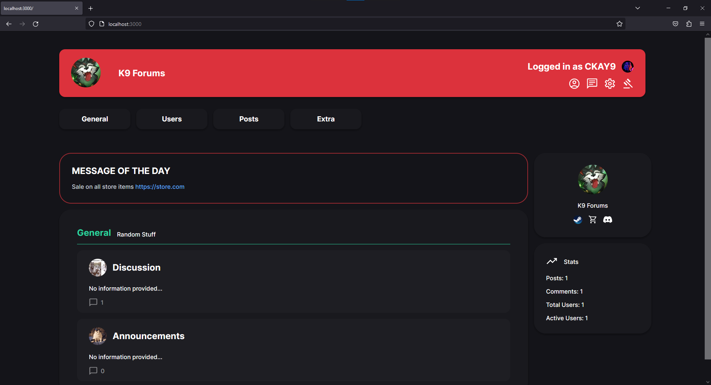
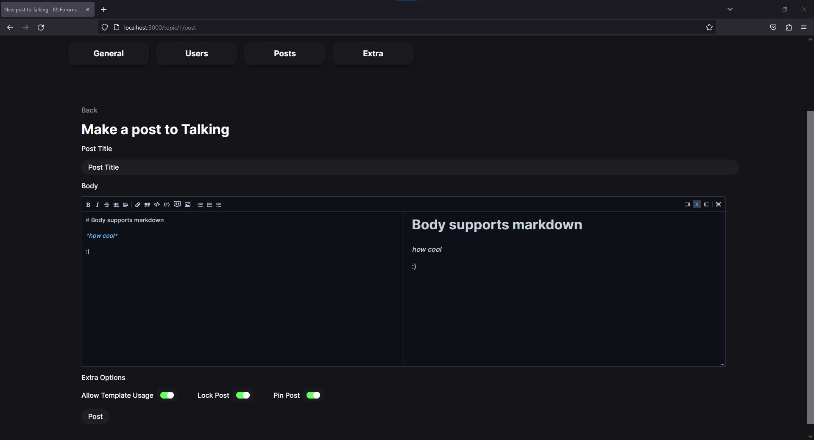

# K9 Forums


<div style="display: flex; flex-direction: column; gap: 1rem;">
    <div style="display: flex; align-items: center; justify-content: center; gap: 1rem;">
        
        
    </div>
    <div style="display: flex; align-items: center; justify-content: center; gap: 1rem;">
        
        
    </div>
</div>

## About

K9 Forums is a free and open-source forum software built with NestJS and NextJS, using TypeScript. K9 Forums is meant to be a simple solution to forums while offering ease-of-use and configurability.

## Credits
- Thank you to <a href="https://github.com/uiwjs">uiwjs</a> for react-markdown preview and editor

## Installation

This project is WIP and not finished. Run at your own risk.

*Docker support is being worked on*

```bash
# Clone the project
git clone https://github.com/CKAY-9/k9-forums.git

### Backend setup ###
cd backend
npm install

# env setup
export DATABASE_URL=postgres://my_postgres_login

# running
npm run build
npm run start


### Frontend setup ###
cd frontend
npm install

# env setup
export NEXT_PUBLIC_API_URL=http://localhost:3001
export NEXT_PUBLIC_CDN_URL=http://localhost:5000

# running
npm run build
npm run start


### CDN setup ###
cd cdn

# python setup
py -3 -m venv .venv
.venv\Scripts\activate
pip install flask
pip install markupsafe
pip install werkzeug
pip install -U flask-cors

# running
flask --app main run

### WebSocket Server ###
cd ws-server
npm install

# env setup
export INTERNAL_API_URL=http://localhost:3001
export INTERNAL_CDN_URL=http://localhost:5000

# running
npm run build
npm run start

```
    